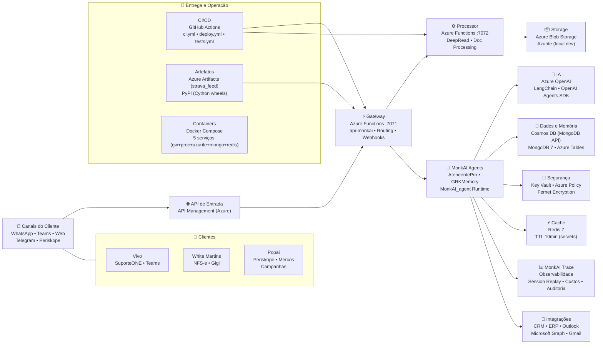
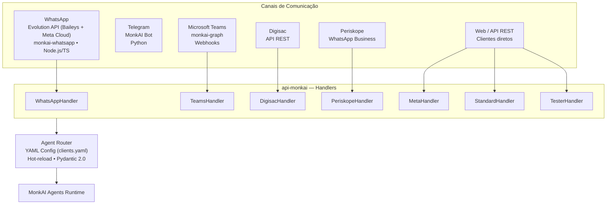
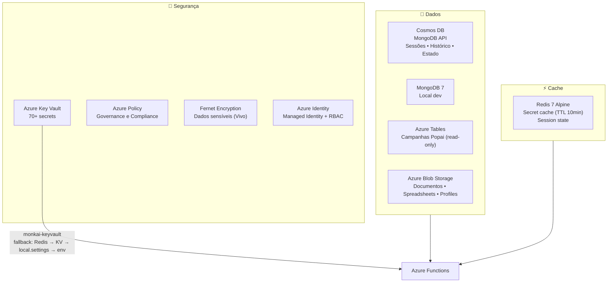
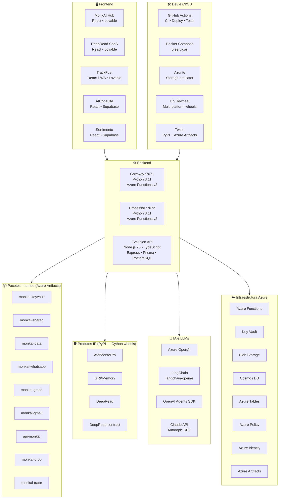
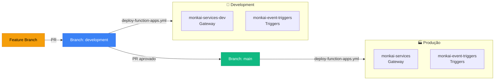
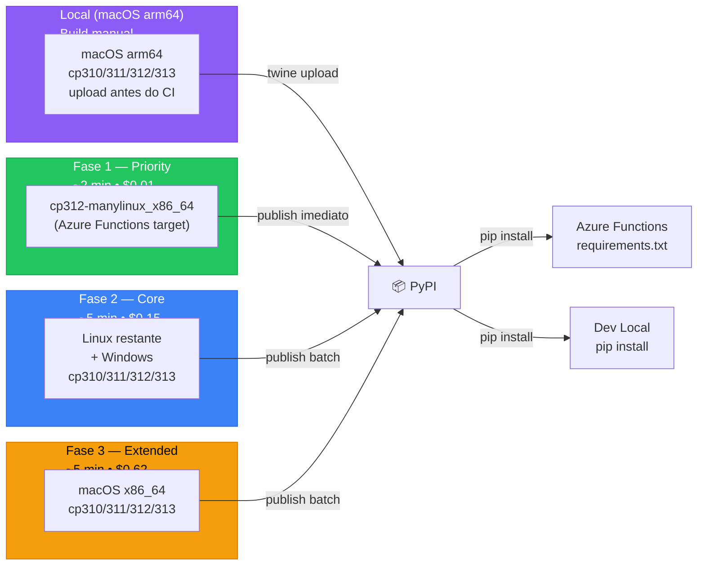

# Arquitetura MonkAI

> Última atualização: 2026-04-01

---

## Visão Geral da Plataforma

---

## Stack de Canais de Entrada

---

## Stack de Dados e Segurança

---

## Stack Completa por Camada

---

## Ambientes de Deploy

---

## GitHub Workflows — Mapa Completo

```mermaid
flowchart TB
    subgraph AS["Azure-Servers"]
        direction TB
        AS_CI["✅ CI<br/>ci.yml<br/><i>push + PR → lint + validate</i>"]
        AS_TEST["🧪 Tests<br/>tests.yml<br/><i>push + PR → pytest repo inteiro</i>"]
        AS_DEPLOY["🚀 Deploy Function Apps<br/>deploy-function-apps.yml<br/><i>CI pass on main → auto deploy</i><br/><i>manual → dev ou prod</i>"]
        AS_TRIGGERS["🚀 Deploy Triggers<br/>deploy-triggers.yml<br/><i>manual → monkai-event-triggers</i>"]
        AS_TESTER["🤖 Test Agents<br/>test-agents.yml<br/><i>manual → monkai-tester KPIs</i>"]

        AS_CI -->|"main ✅"| AS_DEPLOY
        AS_TEST -.->|"bloqueia merge"| AS_CI
    end

    subgraph API["api-monkai"]
        direction TB
        API_CI["✅ CI<br/>ci.yml<br/><i>push main/dev + PR → ruff + pytest</i>"]
        API_DEPLOY_READY["🔍 Deploy-ready<br/>deploy_ready.yml<br/><i>push/PR dev → lint + build</i>"]
        API_PUBLISH["📦 Publish Azure<br/>publish_azure.yml<br/><i>push main → Azure Artifacts</i>"]

        API_CI -.->|"quality gate"| API_PUBLISH
    end

    subgraph CYTHON["Produtos Cython (PyPI)"]
        direction TB

        subgraph ATP["AtendentePro"]
            ATP_CI["✅ CI<br/><i>push main/develop + PR</i><br/><i>matrix: 3.10, 3.12, 3.13</i>"]
            ATP_PUB["📦 Publish PyPI<br/><i>push main + pyproject.toml</i><br/><i>3 fases: priority → core → extended</i>"]
        end

        subgraph GRK["GRKMemory"]
            GRK_CI["✅ CI<br/><i>push main/develop + PR</i><br/><i>matrix: 3.10, 3.12, 3.13</i>"]
            GRK_PUB["📦 Publish PyPI<br/><i>push main + pyproject.toml</i><br/><i>cibuildwheel 3 fases</i>"]
        end

        subgraph DR["DeepRead"]
            DR_CI["✅ CI<br/><i>push main/develop + PR</i><br/><i>matrix: 3.10, 3.12, 3.13</i>"]
            DR_PUB["📦 Publish PyPI<br/><i>push main + pyproject.toml</i><br/><i>cibuildwheel 3 fases</i>"]
        end

        subgraph DRC["DeepRead.contract"]
            DRC_CI["✅ CI<br/><i>push main/develop + PR</i>"]
            DRC_PUB["📦 Publish PyPI<br/><i>push main + pyproject.toml</i><br/><i>cibuildwheel 3 fases</i>"]
        end
    end

    subgraph PURE["Pacotes Pure Python"]
        direction TB
        MT_CI["✅ monkai-trace CI<br/><i>push main/develop + PR</i>"]
        MT_PUB["📦 monkai-trace Publish<br/><i>push main + pyproject.toml</i><br/><i>py3-none-any (MIT)</i>"]
    end

    subgraph FRONT["Frontend"]
        direction TB
        AIC_CI["✅ AIConsulta CI<br/><i>push + PR</i>"]
        DIH_CI["✅ DeepRead SaaS CI<br/><i>push + PR</i>"]
        TFC_CI["✅ TrackFuel CI<br/><i>push + PR</i>"]
        HUB["❌ MonkAI Hub<br/><i>sem CI (Lovable)</i>"]
    end

    %% Dependências entre repos
    API_PUBLISH -->|"api_monkai pkg"| AS_DEPLOY
    ATP_PUB -->|"atendentepro pkg"| AS_DEPLOY
    DR_PUB -->|"DeepRead.Monkai pkg"| AS_TRIGGERS
    GRK_PUB -->|"grkmemory pkg"| AS_DEPLOY
    MT_PUB -->|"monkai-trace pkg"| AS_DEPLOY

    classDef ci fill:#22c55e,stroke:#16a34a,color:#fff
    classDef publish fill:#8b5cf6,stroke:#7c3aed,color:#fff
    classDef deploy fill:#f59e0b,stroke:#d97706,color:#000
    classDef test fill:#3b82f6,stroke:#2563eb,color:#fff
    classDef none fill:#6b7280,stroke:#4b5563,color:#fff

    class AS_CI,API_CI,ATP_CI,GRK_CI,DR_CI,DRC_CI,MT_CI,AIC_CI,DIH_CI,TFC_CI ci
    class API_PUBLISH,ATP_PUB,GRK_PUB,DR_PUB,DRC_PUB,MT_PUB publish
    class AS_DEPLOY,AS_TRIGGERS deploy
    class AS_TEST,AS_TESTER,API_DEPLOY_READY test
    class HUB none
```

---

## Pipeline de Publicação — Produtos Cython

---

## Resumo de Workflows por Repo

| Repo | CI | Publish | Deploy | Tests | Trigger |
|---|---|---|---|---|---|
| **Azure-Servers** | `ci.yml` (push+PR) | — | `deploy-function-apps.yml` (auto main + manual) | `tests.yml` + `test-agents.yml` | push, PR, CI pass, manual |
| **api-monkai** | `ci.yml` (push+PR) | `publish_azure.yml` (push main → Azure Artifacts) | — | via CI | push main, PR |
| **AtendentePro** | `ci.yml` (matrix 3.10/12/13) | `publish.yml` (3-phase cibuildwheel → PyPI) | — | via CI | push main+develop, PR |
| **GRKMemory** | `ci.yml` (matrix 3.10/12/13) | `publish.yml` (3-phase cibuildwheel → PyPI) | — | via CI | push main+develop, PR |
| **DeepRead** | `ci.yml` (matrix 3.10/12/13) | `publish.yml` (3-phase cibuildwheel → PyPI) | — | via CI | push main+develop, PR |
| **DeepRead.contract** | `ci.yml` | `publish.yml` (cibuildwheel → PyPI) | — | via CI | push main+develop, PR |
| **monkai-trace** | `ci.yml` | `publish.yml` (py3-none-any → PyPI) | — | via CI | push main+develop, PR |
| **AIConsulta** | `ci.yml` | — | — (Lovable) | via CI | push, PR |
| **DeepRead SaaS** | `ci.yml` | — | — (Lovable) | via CI | push, PR |
| **TrackFuel** | `ci.yml` | — | — (Lovable) | via CI | push, PR |
| **MonkAI Hub** | ❌ | — | — (Lovable) | — | — |
