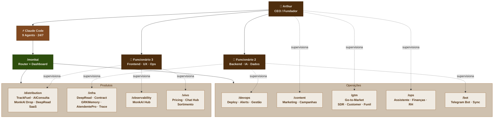

# Organograma MonkAI

> Última atualização: 2026-04-07

A MonkAI opera com **3 humanos + 9 agentes IA consolidados**, cada um com domínios de ownership definidos.
Humanos decidem **o quê** e **por quê**. Agentes executam **como** e **quando**.

---

## Visão Geral



---

## Taxonomia de Produtos

### Produtos de Distribuição (voltados ao cliente final)
| Produto | Repo | Agent |
|---|---|---|
| TrackFuel | `track-fuel-coach` | `/distribution` |
| AIConsulta | `aiconsulta` | `/distribution` |
| MonkAI Drop | `monkai-drop` | `/distribution` |
| DeepRead SaaS | `document-insight-hub` | `/distribution` |

### Produtos de Infraestrutura (IP protegido — Cython)
| Produto | Repo | Agent |
|---|---|---|
| DeepRead | `DeepRead` | `/infra` |
| DeepRead Contract | `DeepRead.contract` | `/infra` |
| GRKMemory | `GRKMemory` | `/infra` |
| AtendentePro | `monkai_atendentepro` | `/infra` |
| MonkAI Trace | `monkai-trace` | `/infra` |

### Produto de Observabilidade
| Produto | Repo | Agent |
|---|---|---|
| MonkAI Hub | `monkai_site` | `/observability` |

### Produtos Vivo
| Produto | Repo | Agent |
|---|---|---|
| Pricing Compass | `vivo-pricing-compass` | `/vivo` |
| Vivo Chat Hub | `vivo-chat-connect` | `/vivo` |
| Sortimento Inteligente | `Sortimento` | `/vivo` |

### GTM (Go-to-Market)
Estratégia comercial dos produtos de distribuição: DeepRead SaaS, TrackFuel e AIConsulta.
Futuro: SDR, Customer Success, funil de vendas.

---

## Matriz de Responsabilidade

| Domínio | Humano (Dono) | Agent (Executor) | Relação |
|---|---|---|---|
| **Estratégia** | Arthur | `/monkai`, `/ops` | Arthur decide, agent organiza |
| **DevOps / CI/CD** | Arthur + Func. 2 | `/devops` | Agent executa, humano aprova |
| **Infra / Backend** | Func. 2 | `/infra` | Humano arquiteta, agent implementa |
| **Integrações** | Func. 2 | `/bot` | Humano define, agent conecta |
| **Frontend / Distribuição** | Func. 3 | `/distribution` | Humano desenha, agent constrói |
| **Observabilidade** | Func. 3 | `/observability` | Humano monitora, agent desenvolve |
| **Produtos Vivo** | Func. 3 | `/vivo` | Humano gerencia, agent implementa |
| **Comercial / GTM** | Arthur | `/gtm` | Agent produz estratégia, Arthur valida |
| **Conteúdo / Marketing** | Arthur | `/content` | Agent produz conteúdo, Arthur valida |
| **Financeiro** | Arthur | `/ops` | Agent consulta/organiza, Arthur aprova |
| **RH** | Arthur | `/ops` | Agent estrutura processos, Arthur decide |

---

## Catálogo de Agents

### 🎯 Router Central

| Agent | Função | Comando |
|---|---|---|
| **MonkAI Router** | Dashboard executivo + roteamento por keywords para agents | `/monkai` |

### 📦 Distribution Agent

| Produto | Função | Repo |
|---|---|---|
| TrackFuel | PWA de coaching fitness e nutrição | `track-fuel-coach` |
| AIConsulta | SaaS para clínicas com IA | `aiconsulta` |
| MonkAI Drop | Produto de distribuição de conteúdo | `monkai-drop` |
| DeepRead SaaS | Document Insight Hub | `document-insight-hub` |

### ⚙️ Infra Agent

| Produto | Função | Repo |
|---|---|---|
| DeepRead | Biblioteca de OCR e extração de documentos | `DeepRead` |
| DeepRead Contract | Análise automatizada de contratos | `DeepRead.contract` |
| GRKMemory | Memória contextual para agentes IA | `GRKMemory` |
| AtendentePro | Agente de atendimento multi-agente | `monkai_atendentepro` |
| MonkAI Trace | SDK de observabilidade para agentes | `monkai-trace` |

### 📊 Observability Agent

| Produto | Função | Repo |
|---|---|---|
| MonkAI Hub | Dashboard central e site institucional | `monkai_site` |

### 🟣 Vivo Agent

| Produto | Função | Repo |
|---|---|---|
| Pricing Compass | Inteligência de precificação | `vivo-pricing-compass` |
| Vivo Chat Hub | Hub de atendimento Vivo | `vivo-chat-connect` |
| Sortimento | Sortimento inteligente de produtos | `Sortimento` |

### ☁️ DevOps Agent

| Componente | Função |
|---|---|
| Deploy | Deploy Azure Function Apps e Artifacts |
| Alerts | Sistema de alertas de erro/exceção |
| Gestão | PRs, issues, board kanban, CI/CD |

### 🎨 Content Agent

| Componente | Função |
|---|---|
| Marketing | Conteúdo de marca, campanhas, redes sociais |

### 🚀 GTM Agent

| Componente | Função |
|---|---|
| Go-to-Market | Estratégia GTM para DeepRead SaaS, TrackFuel, AIConsulta |
| *Futuro: SDR* | *Captura de leads* |
| *Futuro: Customer* | *Customer success* |

### 📋 Ops Agent

| Componente | Função |
|---|---|
| Assistente | Agenda, tarefas, email, reuniões, planejamento |
| Finanças | NFs, fluxo de caixa, contratos, cobranças |
| RH | Contratação, cultura, processos seletivos |

### 🤖 Bot Agent

| Componente | Função |
|---|---|
| MonkAI Bot | Bot Telegram da MonkAI (Railway) |
| Sync | Sincronização Claude Code ↔ Bot |

---

## Estrutura Técnica dos Agents

### Arquivos (Claude Code)

```
~/.claude/commands/
├── monkai.md                        # Router (dashboard + roteamento)
├── distribution/
│   ├── distribution.md              # Agent principal
│   ├── trackfuel.md
│   ├── aiconsulta.md
│   ├── monkaidrop.md
│   └── deepread-saas.md
├── infra/
│   ├── infra.md
│   ├── deepread.md
│   ├── deepread-contract.md
│   ├── grkmemory.md
│   ├── atendentepro.md
│   └── monkai-trace.md
├── observability/
│   ├── observability.md
│   └── monkai-hub.md
├── vivo/
│   ├── vivo.md
│   ├── pricing.md
│   ├── vivo-chat-hub.md
│   └── sortimento.md
├── devops/
│   ├── devops.md
│   ├── deploy.md
│   ├── alerts.md
│   └── gestao.md
├── content/
│   ├── content.md
│   └── marketing.md
├── gtm/
│   ├── gtm.md
│   └── gtm-strategy.md
├── ops/
│   ├── ops.md
│   ├── assistente.md
│   ├── financas.md
│   └── rh.md
└── bot/
    ├── bot.md
    ├── monkai-bot.md
    └── sync.md
```

### Memória (por agent)

```
~/.claude/projects/-Users-arthurvaz/memory/
├── MEMORY.md                        # Index global
├── user_*.md, feedback_*.md         # Compartilhadas
├── reference_*.md, project_*.md     # Globais
├── distribution/                    # Dedicadas por agent
├── infra/
├── observability/
├── vivo/
├── devops/
├── content/
├── gtm/
├── ops/
└── bot/
```

### Mecânica de Roteamento

1. **Direto**: `/infra "rodar testes do deepread"` → carrega `infra/infra.md` → classifica keywords → `Read` de `infra/deepread.md` → executa
2. **Via router**: `/monkai "rodar testes do deepread"` → classifica → despacha para `/infra` via `Skill` tool
3. **Via Bot**: Telegram → classifica → carrega prompt do agent correspondente

---

## Princípios

1. **Humano = dono do domínio** — decide, aprova, tem accountability
2. **Agent = operador do domínio** — executa, monitora, escala
3. **Cada domínio tem exatamente 1 dono humano** — sem ambiguidade
4. **Claude Code é o 4º funcionário** — opera 24/7, mantém contexto via memories
5. **3 humanos + 9 agents = capacidade operacional de ~10 pessoas**
6. **Skills consolidadas em agents** — 21 skills → 9 agents por domínio
7. **Router `/monkai`** — dashboard + linguagem natural para roteamento
8. **Evolução futura** — Agent SDK quando necessário (multi-tenant, API externa, 24/7)
