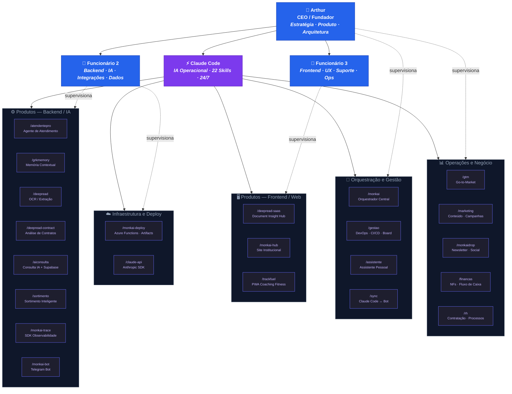

# Organograma MonkAI

> Última atualização: 2026-04-01

A MonkAI opera com **3 humanos + 22 agentes IA**, cada um com domínios de ownership definidos.
Humanos decidem **o quê** e **por quê**. Agentes executam **como** e **quando**.

---

## Visão Geral

---

## Matriz de Responsabilidade

| Domínio | Humano (Dono) | Agente (Executor) | Relação |
|---|---|---|---|
| **Estratégia** | Arthur | `/monkai`, `/assistente` | Arthur decide, agente organiza |
| **DevOps / CI/CD** | Arthur | `/gestao`, `/monkai-deploy` | Agente executa, Arthur aprova |
| **Backend / IA** | Func. 2 | `/atendentepro`, `/grkmemory`, `/deepread`, `/monkai-trace` | Humano arquiteta, agente implementa |
| **Integrações** | Func. 2 | `/monkai-bot`, `/sync`, `/claude-api` | Humano define, agente conecta |
| **Frontend** | Func. 3 | `/monkai-hub`, `/deepread-saas`, `/trackfuel` | Humano desenha, agente constrói |
| **Comercial** | Arthur | `/gtm`, `/marketing`, `/monkaidrop` | Agente produz conteúdo, Arthur valida |
| **Financeiro** | Arthur | `/financas` | Agente consulta/organiza, Arthur aprova |
| **RH** | Arthur | `/rh` | Agente estrutura processos, Arthur decide |

---

## Catálogo de Agentes

### 🎯 Orquestração e Gestão

| Skill | Função | Repo Principal |
|---|---|---|
| `/monkai` | Orquestrador central — roteia para a skill correta | — |
| `/gestao` | DevOps, CI/CD, PRs, issues, board kanban, deploys | Todos |
| `/assistente` | Assistente pessoal do Arthur | — |
| `/sync` | Sincronizador entre Claude Code local e MonkAI Bot | — |

### ⚙️ Produtos — Backend / IA

| Skill | Função | Repo |
|---|---|---|
| `/atendentepro` | Agente de atendimento ao cliente | `monkai_atendentepro` |
| `/grkmemory` | Memória contextual para agentes IA | `GRKMemory` |
| `/deepread` | Biblioteca de OCR e extração de documentos | `DeepRead` |
| `/deepread-contract` | Análise automatizada de contratos | `DeepRead.contract` |
| `/aiconsulta` | Consulta IA com Supabase | `aiconsulta` |
| `/sortimento` | Sortimento inteligente de produtos | — |
| `/monkai-trace` | SDK de observabilidade para agentes | `monkai-trace` |
| `/monkai-bot` | Bot Telegram da MonkAI | — |

### 🖥️ Produtos — Frontend / Web

| Skill | Função | Repo |
|---|---|---|
| `/deepread-saas` | DeepRead SaaS (Document Insight Hub) | `document-insight-hub` |
| `/monkai-hub` | Site institucional MonkAI | `monkai_site` |
| `/trackfuel` | PWA de coaching fitness | `track-fuel-coach` |

### 📊 Operações e Negócio

| Skill | Função | Escopo |
|---|---|---|
| `/gtm` | Estratégia Go-to-Market | Comercial |
| `/marketing` | Conteúdo, campanhas, marca | Marketing |
| `/monkaidrop` | Newsletter e conteúdo social | Conteúdo |
| `/financas` | NFs, fluxo de caixa, contratos | Financeiro |
| `/rh` | Contratação, cultura, processos | Pessoas |

### ☁️ Infraestrutura e Deploy

| Skill | Função | Repo |
|---|---|---|
| `/monkai-deploy` | Deploy Azure Function Apps e Artifacts | `Azure-Servers` |
| `/claude-api` | Integração com Anthropic SDK | — |

---

## Princípios

1. **Humano = dono do domínio** — decide, aprova, tem accountability
2. **Agente = operador do domínio** — executa, monitora, escala
3. **Cada domínio tem exatamente 1 dono humano** — sem ambiguidade
4. **Claude Code é o 4º funcionário** — opera 24/7, mantém contexto via memories
5. **3 humanos + 22 agentes = capacidade operacional de ~10 pessoas**
